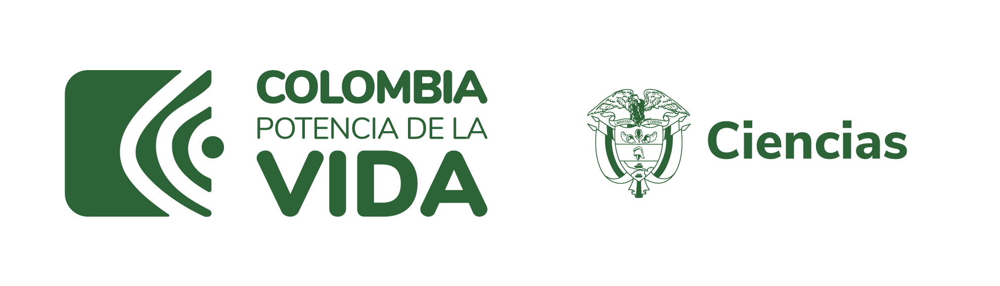

# The Gotita Project - Young Innovators 2023

This repository has been made in the context of the Young Innovator scholarship of 2023 granted by the Colombian Ministry of Science. Our ambition is to create a water quality monitoring system for rural isolated zones.

  

## Problem Statement

In 2017, an estimated 1.2 million people died due to unsafe water sources. This was 2.2% of global deaths. More particularly, In Colombia, there is a severe problem with access to drinking water in rural areas, where the supply doesn't exceed 35%. In addition, in 2020 approximately 884,545 cases of Acute Diarrheal Disease (ADD) were estimated. This disease is highly related to the consumption of water of poor quality.

  

Ensuring good water quality is a huge challenge for public utility companies, governments, and NGOs. Nowadays, in rural areas, water quality is being measured with manual techniques, and samples need to be transported to laboratories that are very far away from these places. In fact, more than 35% of water samples wouldn't reach laboratories on time to be correctly analyzed.

## Proposal for the young innovator scholarship of 2023

The Gotita Project it's a system that can measure water quality variables and send them to the cloud through the LoRaWAN protocol. To collect the data, we will use environmental electronic sensors. This system will be connected to a web app to visualize the data. 

**Measured variables:**
- Ph
- Temperature
- Water Level
- Turbidity
- Conductivity
- Dissolved Oxygen

## Index
1. [CAD](./cad)
2. [Microcontrollers](./microcontrollers)
3. [Web App](.webapp)

  

## License 

This repository is under [MIT License](./LICENSE.md).
