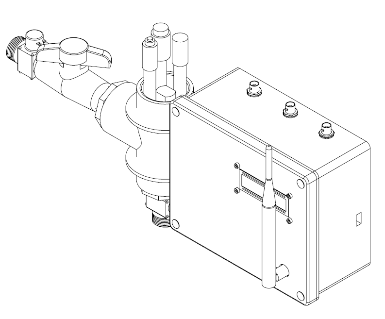

# Designing of the system

## First Version of TGP

The first version of the TGP have been designed with PVC components that can be found commercially in shops specialized in construction. There also some
components that have been designed for 3D printing and laser manufacturing of acrylic. 

Some weakness have been detected in this first version. First of all, the use screws and brackets to attach the T tube and the box isn't optimal. We also 
have detected a risk with insects, particurally with ants. Future versions need to be improve the sealing of electronic components to prevent the damage that can 
be related to insects.

  

