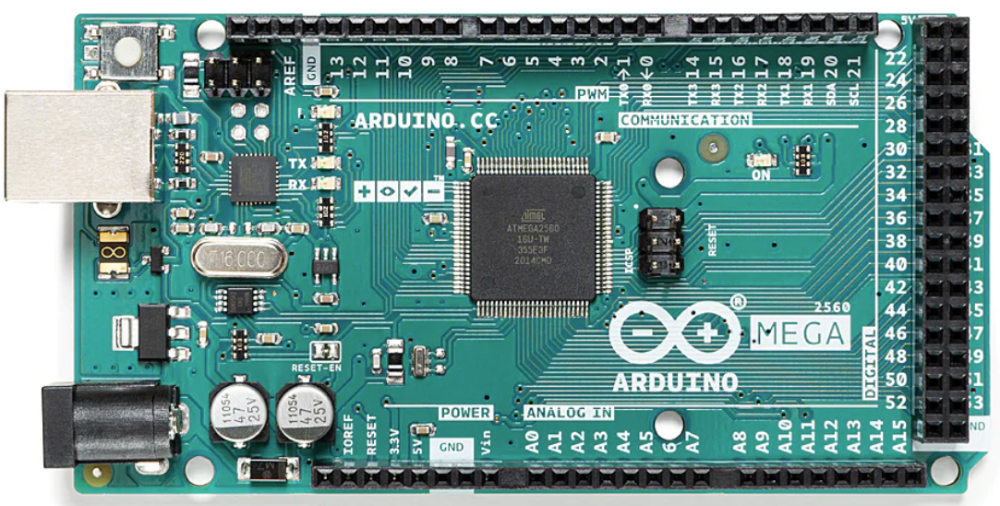
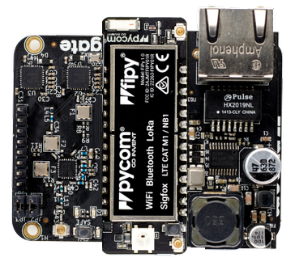
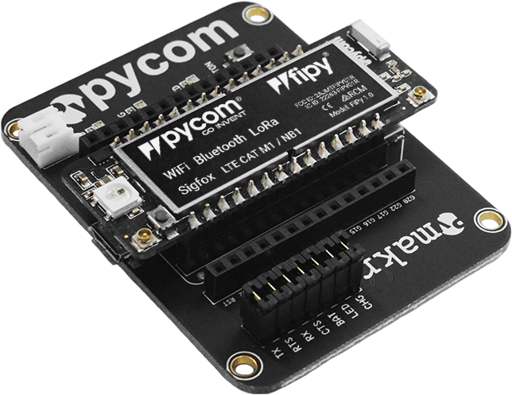

# Microcontrollers

In this directory you will find: 

- The circuits for the node.
- Code sample to configure the Pygate
- Code to configure the Fipy/Lopy or the Arduino.

## [Arduino](./arduino)

If you want to learn and test the sensors before using them on Pycom boards, we have added the code to use these sensors with Arduino. You can also find the associated circuit where all the connections are shown. Since input analog pins can support the 5V sent by the sensors, a voltage divider is not needed.

  

## [Pycom](./pycom)

Pycom microcontrollers can work with multiples RF. Their microcontrollers are based on the ESP32 and use Micropython as the coding language. The LoRaWAN protocol works with a Gateway that receives messages sent by the nodes through LoRa RF, and uploads them to the cloud through an Ethernet protocol or WiFi.

  

### [Gateway - Pygate](./pycom/pygate)

The Pygate it's a shield for the microcontrollers produced by Pycom that aloud us to configure them as gateways for the LoRaWAN protocol. It will be the gate between the messages sent from the node and The Things Network (TTN). TTN it's a server that can manage our devices connected by LoRaWAN protocol. His role is to receive the payload (corresponding to bits), traduce it to real data, and then sent it to the app through HTTP integration for example.

  

### [Node configuration - FiPy + Expansion board](./pycom/tgp_program)

We have used the FiPy and the 3V expansion board that will be connected to the sensors and the rest of the devices. This microcontroller will send measurements firstly to the Pygate through LoRA RF, and then, the Pygate will upload it to the cloud that is managed by TTN.

  

## License 

This repository is under [MIT License](https://github.com/clem-gh/TheGotitaProject_YI2023/blob/main/LICENSE.md).
