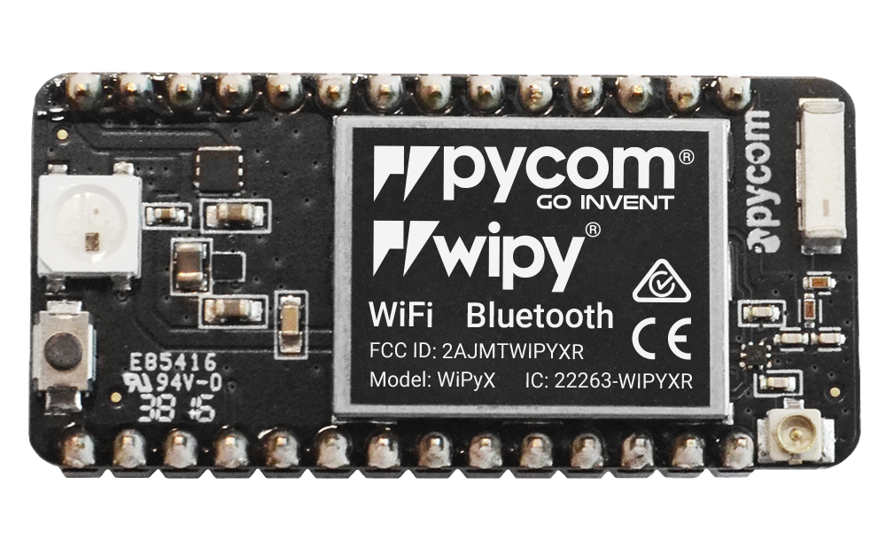

# Microcontrollers

In this directory you will find: 

- The circuits for the node.
- Code sample to configure the Pygate
- Code to configure the Fipy/Lopy or the Arduino.

## [Arduino](./arduino)

If you want to learn and test the sensors before using them on Pycom boards, we have added the code to use these sensors on the Arduino. You can also find the associated circuit where all the connections are shown. Since their input pins can support the 5V sent by the sensors, a voltage divider is not needed.

  

## [Pycom](./pycom)

Pycom microcontrollers are used specifically for IoT purposes and can work with multiple radio frequencies (RF). These microcontrollers are based on the ESP32 and Micropython is their coding language. 

In this project, we explored the LoRa RF and the LoRaWAN protocol. The LoRaWAN protocol consists of a Gateway that receives messages that are sent by the nodes through LoRa RF and uploads them to the cloud through an Ethernet protocol or WiFi.

  

### [Gateway - Pygate](./pycom/pygate)

The Pygate is the Pycom shield that aloud us to configure the microcontrollers as gateways for the LoRaWAN protocol. They will be the gate between the messages sent from the node and The Things Network (TTN). TTN it's a server that can manage our devices connected by LoRaWAN protocol. Their role is to receive the payload (corresponding to the message in bits), traduce them into real data, and then sent it to the app through HTTP integration for example.

  

### [Node configuration - FiPy + Expansion board](./pycom/tgp_program)

We have used a FiPy and the 3V Expansion Board to connect the sensors and the rest of the devices. This microcontroller will send measurements firstly to the Pygate through LoRA RF in a payload given in bits, and then, the Pygate will traduce it and upload it to the cloud managed by TTN.

  

### [Node configuration Wipy + Expansion board [Extra: MQTT protocol]](./pycom/mqtt)

We have added another example using MQTT protocol and Wipy (This can also be used with the Lopy or Fipy, just don't disconnect the LoRa antenna as this can damage the devices).

  

## License 

This repository is under [MIT License](https://github.com/clem-gh/TheGotitaProject_YI2023/blob/main/LICENSE.md).
