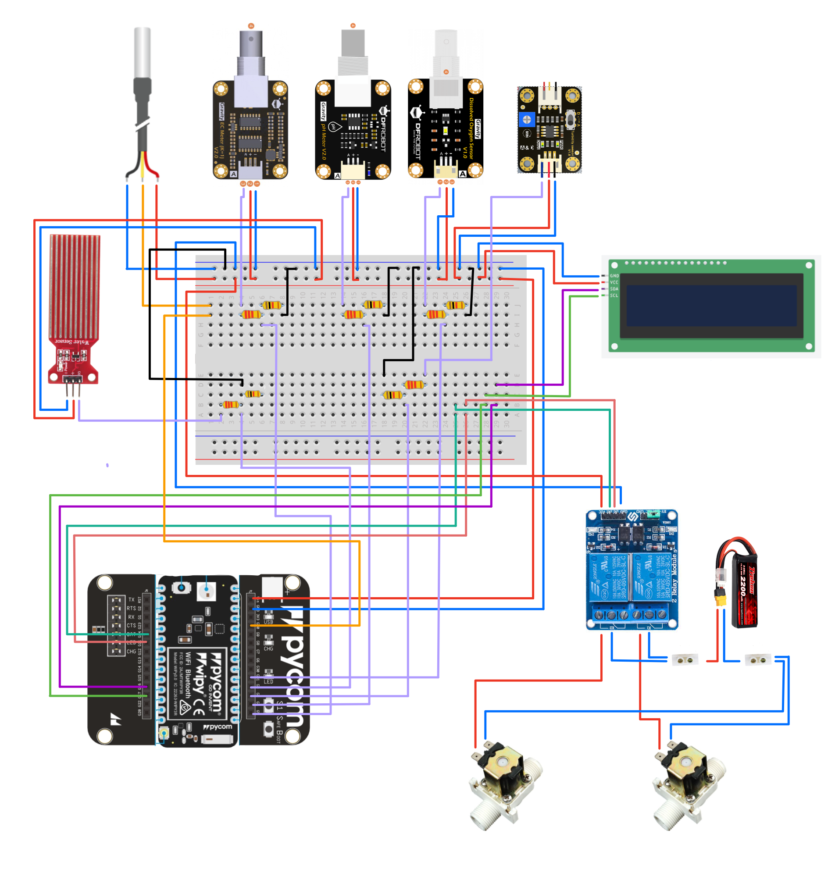

# Circuits

The circuits used for TGP have been added below. There is an important difference between the LoPy and the Fipy because both devices have different functionalities
in some of their pins. For this reason, the Lopy can have more sensors than the Fipy, because some of the pins in the Fipy are used for LTE communication. 

## Circuit using Lopy

  

## Circuito using Fipy

  

## Circuit using Wipy

  

